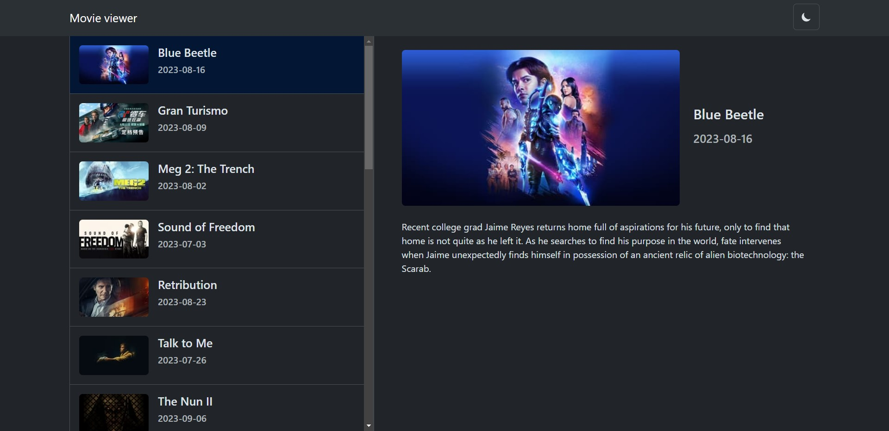
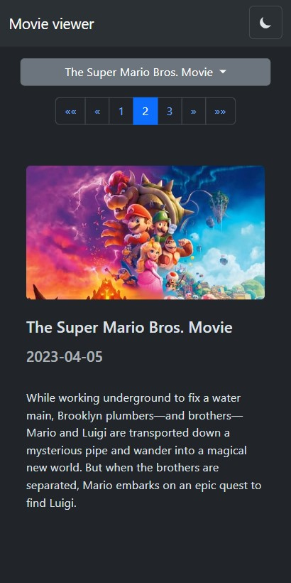
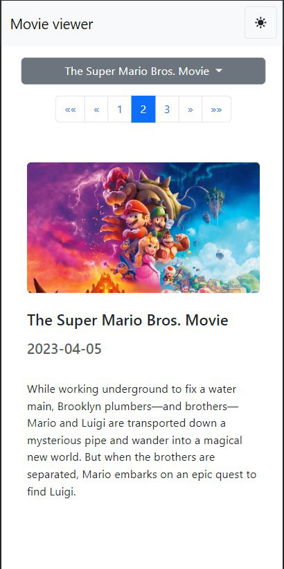

<a name="readme-top"></a>

<!-- PROJECT LOGO -->
<br />
<div align="center">
  <h1 align="center">Movie Viewer</h1>
  <p align="center">
    An Angular and NgRx application that allows users to display a list and detail component of movies using the TMDB openAPI.
    <br />
  </p>
</div>

<!-- TABLE OF CONTENTS -->
<details>
  <summary>Table of Contents</summary>
  <ol>
    <li>
      <a href="#about-the-project">About The Project</a>
      <ul>
        <li><a href="#built-with">Built With</a></li>
      </ul>
    </li>
    <li>
      <a href="#getting-started">Getting Started</a>
      <ul>
        <li><a href="#installation">Installation</a></li>
      </ul>
    </li>
    <li><a href="#usage">Usage</a></li>
    <li><a href="#roadmap">Roadmap</a></li>
    <li><a href="#contact">Contact</a></li>
  </ol>
</details>

<!-- ABOUT THE PROJECT -->

## About The Project

<p align="center">
   
</p>
<p align="center">
  
  
</p>

This application allows users to show a list and details of movies from the TMDB openAPI.

<p align="right">(<a href="#readme-top">back to top</a>)</p>

### Built With

- ![Angular][Angular]
- ![NgRx][NgRx]
- ![TypeScript][TypeScript]
- ![Bootstrap][Bootstrap]
- ![SASS][SASS]
- ![Jasmine][Jasmine]

<p align="right">(<a href="#readme-top">back to top</a>)</p>

<!-- GETTING STARTED -->

## Getting Started

### Installation

1. Clone the repo
   ```sh
   git clone https://github.com/driars/movie-viewer.git
   ```
2. Install NPM packages
   ```sh
   yarn
   ```
3. Enter your API in `.env`
   ```sh
   NG_APP_API_KEY=YOUR_MOVIE_API_KEY
   ```
4. Start the website
   ```sh
   yarn start
   ```
5. Build the website
   ```sh
   yarn build
   ```
6. Test the website
   ```sh
   yarn test
   ```

<p align="right">(<a href="#readme-top">back to top</a>)</p>

<!-- USAGE EXAMPLES -->

## Usage

Users can display lists and details of the books from the TMDB openAPI.
Used `local storage` to save `color mode (dark|light)`. So when the user revisits the application, this setting is restored.
<br/>
Built responsive designs that are compotable for desktop and mobile views and theme switching feature. At first time, the application collects the user's device's color mode and set the application's color mode.
<br/>
Implemented some simple `unit` testings by `Karma` and `Jasmin`. Mocked `NgRx store` and `Web Requests` to test the components.
<br/>
Utilized `Bootstrap` to build responsive designs of this project.

<p align="right">(<a href="#readme-top">back to top</a>)</p>

<!-- ROADMAP -->

## Roadmap

- [x] Display a list of the movies
- [x] Use `NgRx` for state management
- [x] Handle `loading`, `error`, and `success` status
- [x] Build responsive designs that work on both desktop and mobile views
- [x] Use `Bootstrap` and `SCSS` to build UI components
- [x] Implement pagination for the list of the movies
- [x] Build unit testings by `Karma` and `Jasmin`

<p align="right">(<a href="#readme-top">back to top</a>)</p>

<!-- CONTACT -->

## Contact

driars - driars0329@gmail.com

Project Link: [https://github.com/driars/movie-viewer](https://github.com/driars/movie-viewer)

<p align="right">(<a href="#readme-top">back to top</a>)</p>

<!-- MARKDOWN LINKS & IMAGES -->
<!-- https://www.markdownguide.org/basic-syntax/#reference-style-links -->

[Angular]: https://img.shields.io/badge/Angular-DD0031?style=for-the-badge&logo=angular&logoColor=white
[NgRx]: https://img.shields.io/badge/NgRx-BA2BD2?style=for-the-badge&logo=ngrx&logoColor=fff
[TypeScript]: https://img.shields.io/badge/TypeScript-007ACC?style=for-the-badge&logo=typescript&logoColor=white
[Bootstrap]: https://img.shields.io/badge/Bootstrap-563D7C?style=for-the-badge&logo=bootstrap&logoColor=white
[SASS]: https://img.shields.io/badge/Sass-CC6699?style=for-the-badge&logo=sass&logoColor=white
[Jasmine]: https://img.shields.io/badge/Jasmine-8A4182?style=for-the-badge&logo=jasmine&logoColor=fff
